# Building Personal AI Assistants for Work: Leveraging AI Coding Agents, Browser Sessions, and Modular Workflows

## Overview

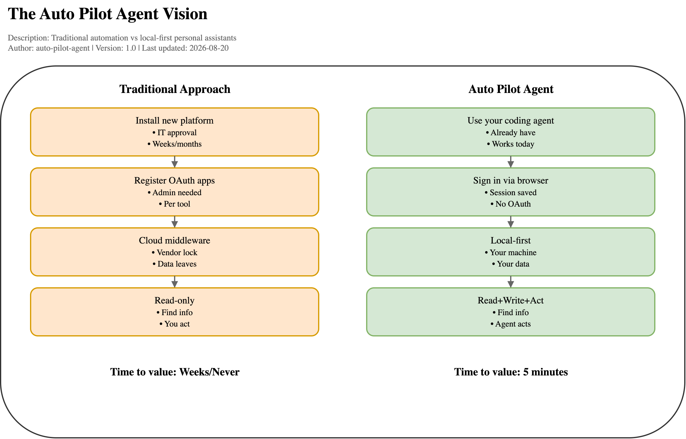

*Editable source: [auto-pilot-vision.drawio](assets/diagrams/auto-pilot-vision.drawio)*

**What this enables:**
- ✅ Connect any tool (Slack, Jira, GitHub, Grafana, internal portals)
- ✅ Search across all tools simultaneously
- ✅ Automate complex multi-tool workflows
- ✅ No platform rollout, no IT approval, no OAuth apps
- ✅ Local-first (data stays on your machine)
- ✅ Works today with the coding agent you already use

---

## Table of Contents

1. [The Evolution from Coding Assistant to Personal Work Assistant](#the-evolution-from-coding-assistant-to-personal-work-assistant)
2. [The Core Problem: The Automation Friction Wall](#the-core-problem-the-automation-friction-wall)
3. [The Solution: Local-First, Zero-Infrastructure Personal Assistants](#the-solution-local-first-zero-infrastructure-personal-assistants)
4. [The Architecture: Two Layers](#the-architecture-two-layers)
   - [Layer 1: Shared Infrastructure - Tool Connections & Browser Sessions](#layer-1-shared-infrastructure---tool-connections--browser-sessions)
   - [Layer 2: Specialized Agent Layer](#layer-2-specialized-agent-layer)
5. [The Agent UX Philosophy](#the-agent-ux-philosophy)
6. [Read + Write + Act: Beyond Enterprise Search](#read--write--act-beyond-enterprise-search)
7. [Security and Trust Model](#security-and-trust-model)
8. [The Implementation: How It Works](#the-implementation-how-it-works)
   - [Multi-Agent Communication via Scratchpad & Brief](#5-multi-agent-communication-via-scratchpad--brief)
9. [The Agent Development Experience](#the-agent-development-experience)
10. [What This Enables](#what-this-enables)
11. [Real-World Examples](#real-world-examples)
12. [Technical Requirements](#technical-requirements)
13. [The Future: Skills and Agent Libraries](#the-future-skills-and-agent-libraries)
14. [Lessons Learned](#lessons-learned)
15. [Conclusion](#conclusion)

---

## The Evolution from Coding Assistant to Personal Work Assistant

The Auto Pilot Agent project represents a paradigm shift in how we think about AI coding assistants. While tools like Cursor, Claude Code and Codex started as coding companions, they have evolved into something far more powerful: **general-purpose automation platforms that can interact with any tool on your laptop**.

This article explores how we're leveraging modern AI coding assistants to build sophisticated personal work assistants—without requiring company-wide platform rollouts, admin approvals, or new infrastructure.

## The Core Problem: The Automation Friction Wall

Most employees face an impossible choice when they want AI to help with their work:

1. **Wait for IT approval** to install a new automation platform
2. **Register OAuth apps** and configure webhooks across multiple systems
3. **Accept vendor lock-in** to cloud middleware (Zapier, MCP servers, hosted agents)
4. **Navigate security reviews** for new service accounts and permissions

For the vast majority of knowledge workers, these barriers mean AI automation never happens.

## The Solution: Local-First, Zero-Infrastructure Personal Assistants

Auto Pilot Agent takes a radically different approach. Instead of adding new infrastructure, it leverages what you already have:

- **Your coding agent** (Cursor, Claude Code, Codex, Copilot)
- **Your browser and session authentication**
- **Your local machine**
- **Your existing permissions**
- **Your desktop apps**

The key insight: **Coding agents can already read files, run scripts, call APIs, use browsers, and work across your local environment.** We're just extending that capability for general work automation.

## The Architecture: Two Layers

The Auto Pilot Agent architecture consists of two layers that work together to enable sophisticated personal work automation:

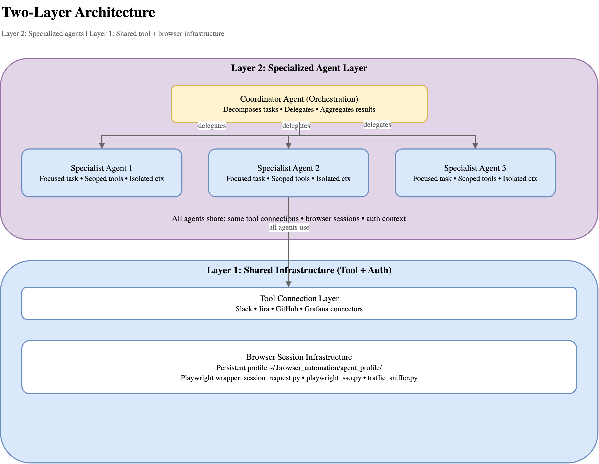

*Editable source: [two-layer-architecture.drawio](assets/diagrams/two-layer-architecture.drawio)*

### Layer 1: Shared Infrastructure - Tool Connections & Browser Sessions

The foundation is a novel approach to tool integration that prioritizes **zero-friction setup** over architectural purity.

**The Stack**:

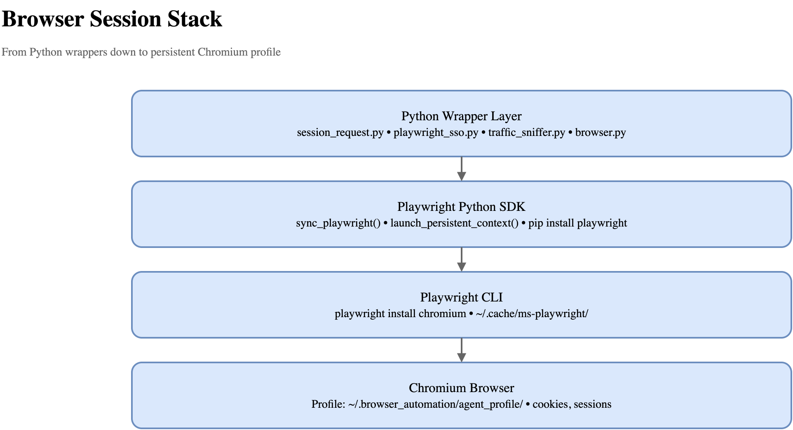

*Editable source: [browser-stack.drawio](assets/diagrams/browser-stack.drawio)*

#### The Browser Session Innovation

Traditional API integrations require:
- Creating OAuth apps
- Generating API tokens
- Managing credentials across systems
- Dealing with regional variants and API versioning

Our approach uses **persistent browser sessions** as the universal authentication mechanism:

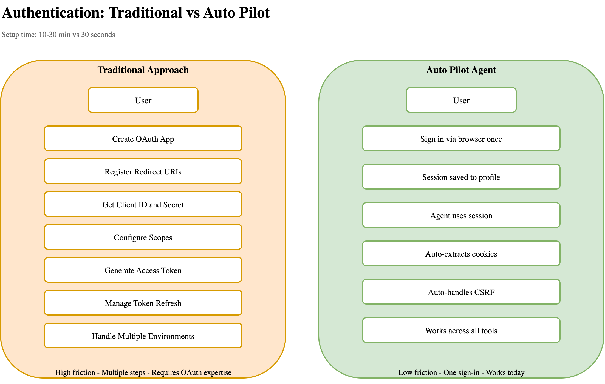

*Editable source: [auth-comparison.drawio](assets/diagrams/auth-comparison.drawio)*

```python
from shared_utils.session_request import tool_request

# Single line to call any authenticated API
result = tool_request("slack", "GET", 
    "https://yourcompany.slack.com/api/conversations.list")
```

Behind the scenes, this:
1. Reuses a **persistent browser profile** (`~/.browser_automation/agent_profile/`)
2. Extracts authentication cookies and tokens automatically
3. Handles CSRF tokens and session refresh
4. Works across SSO, OAuth, and session-based auth

**The user experience**: Sign in once through your browser. The agent can then act as you—using your existing access, with your name on every action.

#### Traffic Sniffing for API Discovery

When official API documentation is incomplete or endpoints aren't publicly documented, we use a traffic sniffer:

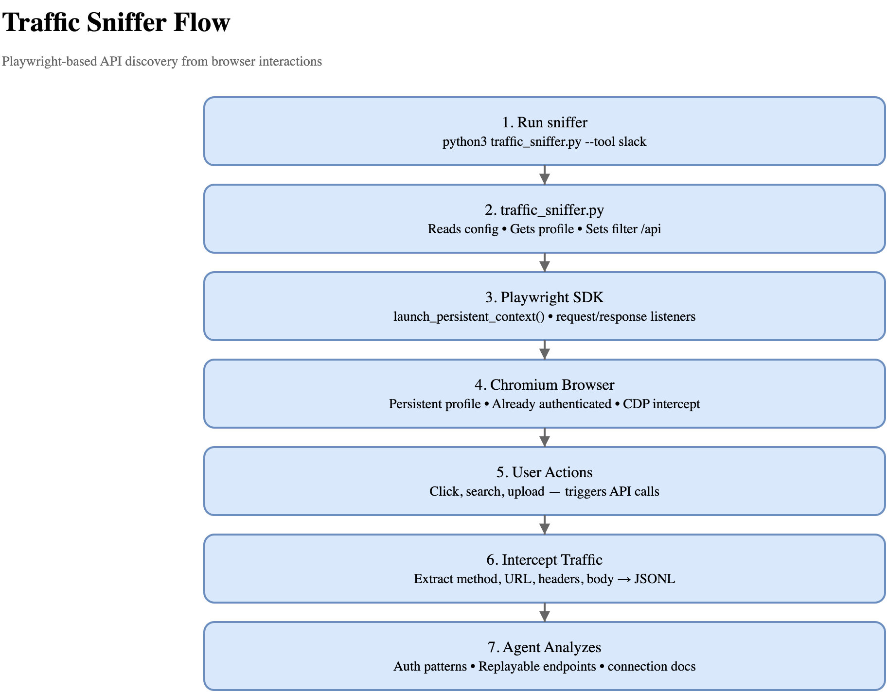

*Editable source: [traffic-sniffer-flow.drawio](assets/diagrams/traffic-sniffer-flow.drawio)*

**Key Components**:
- **traffic_sniffer.py**: Python wrapper that orchestrates the discovery
- **Playwright Python SDK**: Provides programmatic browser control
- **Playwright CLI**: Manages browser binaries (chromium, firefox, webkit)
- **Chromium**: Actual browser with persistent profile for authenticated sessions
- **Chrome DevTools Protocol (CDP)**: How Playwright intercepts network traffic

```bash
python3 shared_utils/traffic_sniffer.py --tool linkedin
```

This opens the tool in the persistent browser profile and records all API calls as you interact with the UI—capturing URLs, headers, auth tokens, and request bodies. The result is a JSONL file of replayable API calls.

This approach lets us connect to:
- **Internal company tools** (deployment portals, incident trackers, custom dashboards)
- **Commercial tools** (Slack, Confluence, Jira, GitHub, LinkedIn, Grafana)
- **Any web application** with an API or browser interface

### Layer 2: Specialized Agent Layer

Specialized agents are AI agents with focused responsibilities. They share the same infrastructure layer (tools and browser sessions) but have:

- **Scoped tools and permissions** - Each agent only accesses what it needs
- **Focused instructions and constraints** - Single-purpose, well-defined tasks
- **Independent execution contexts** - No shared conversation state
- **Lifecycle hooks for validation** - Safety gates and output validation

#### Case Study: The Incident Investigation Agent System

The incident investigation agent system demonstrates the full power of this architecture. When investigating a production incident, a coordinator agent decomposes the problem and delegates to specialist agents:

**Architecture**:

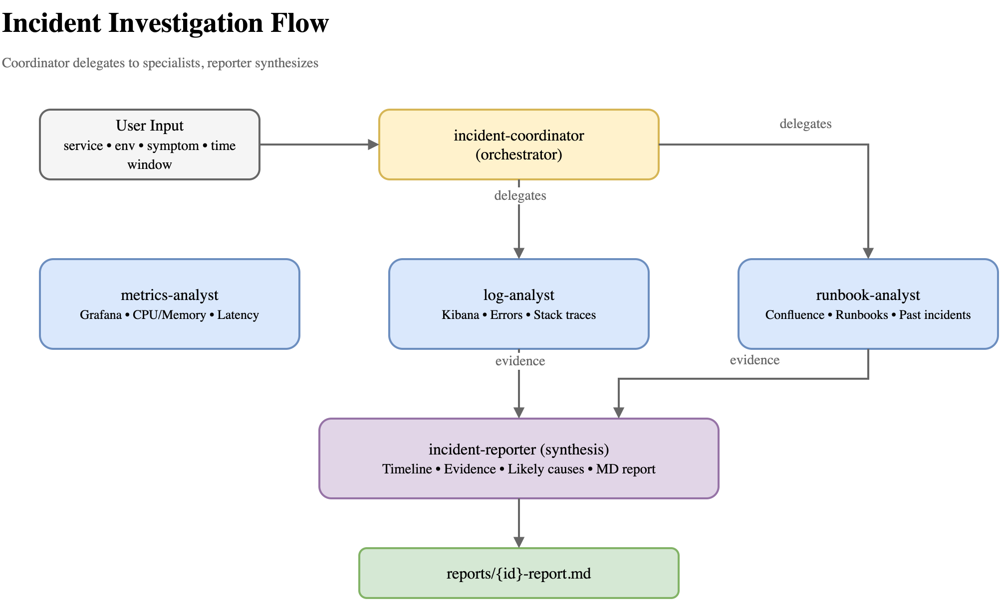

*Editable source: [incident-investigation-flow.drawio](assets/diagrams/incident-investigation-flow.drawio)*

**Execution Flow**:

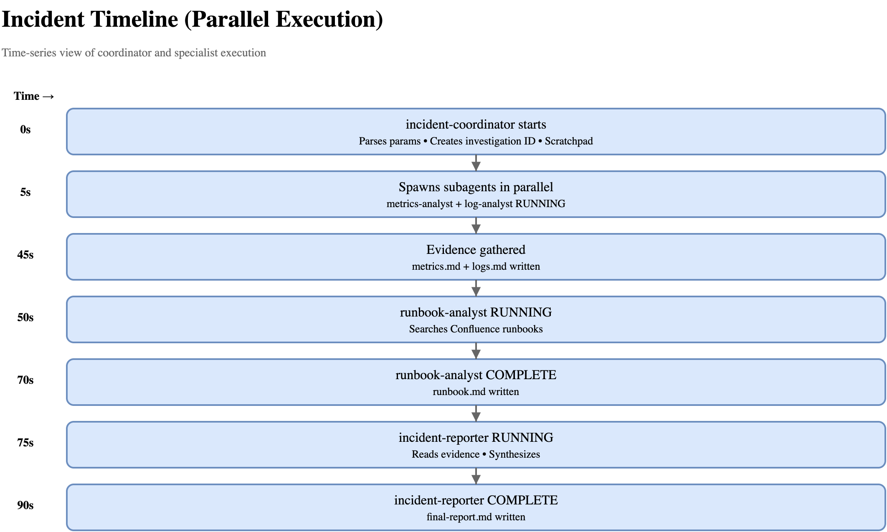

*Editable source: [incident-parallel-timeline.drawio](assets/diagrams/incident-parallel-timeline.drawio)*

**How it works**:

1. **Coordinator receives incident**: service, environment, symptom, time window
2. **Routes by symptom class**:
   - OOM/restarts → `metrics-analyst` + `log-analyst` (parallel)
   - Latency/errors → `metrics-analyst` + `log-analyst` (parallel)
   - Unknown → `runbook-analyst` first, then others based on findings
3. **Specialists gather evidence**:
   - Each uses its own tool connections
   - Each operates in isolation (no shared context)
   - Each writes findings to a scratchpad
4. **Reporter synthesizes**: structured markdown report with evidence, timeline, likely causes

**Agent definitions** are markdown files with frontmatter:

```markdown
---
name: metrics-analyst
description: Use for Grafana metrics — restart counts, CPU/memory usage, HTTP error rate, and latency
tools:
  - Read
  - Write
  - Bash
  - AskUserQuestion
---

# Metrics Analyst

Measure incident impact and corroborate hypotheses...
```

#### Lifecycle Hooks: Safety and Validation

Specialized agents are governed by hooks defined in `.agents/settings.json`:

```json
{
  "permissions": {
    "allow": ["Read", "Write", "Bash", "Agent"],
    "deny": [
      "Bash(git push *)",
      "Bash(terraform apply *)"
    ]
  },
  "hooks": {
    "PreToolUse": [{
      "matcher": "Bash",
      "hooks": [{
        "type": "command",
        "command": "python3 .agents/hooks/block_unsafe_shell.py"
      }]
    }],
    "Stop": [{
      "hooks": [{
        "type": "command",
        "command": "python3 .agents/hooks/validate_final_report.py"
      }]
    }]
  }
}
```

This prevents destructive actions (deployments, force pushes) and validates outputs (ensuring incident reports have required fields).

## The Agent UX Philosophy

A key innovation is the **agent-first user experience**:

**Do as much as possible. Ask as little as possible. Ask non-technically.**

Principles:
- **Never paste commands** for the user to run—the agent runs them
- **Ask for URLs first**—they reveal base URLs, workspaces, and regional variants
- **Infer authentication**—try browser session before asking for API tokens
- **Ask only for missing info**—be specific, not vague
- **Use plain language**—not technical jargon

Example interaction:
```
User: "Connect to Jira"
Agent: [checks for existing connection]
Agent: [finds Jira recipe]
Agent: "What's a link to any Jira ticket?"
User: "https://company.atlassian.net/browse/PROJ-123"
Agent: [extracts base URL: company.atlassian.net]
Agent: [tries browser session auth via playwright_sso.py]
Agent: [verifies connection]
Agent: "Connected to Jira at company.atlassian.net ✓"
```

## Read + Write + Act: Beyond Enterprise Search

Most AI tools are **read-only**—they find information and surface it in chat. You then manually take action.

Auto Pilot Agent is **read + write + act**:

- Doesn't just find the Jira ticket → **updates it**
- Doesn't just summarize the Slack thread → **posts the summary back**
- Doesn't just locate the bug → **opens the PR that fixes it**

The output isn't text in a box. **The output is the thing done, in the right place, in the right tool.**

Example workflows enabled:

**Sprint Triage**
```
Review my Jira sprint, identify stale tickets, and draft follow-up comments.
```
The agent:
1. Queries Jira for your sprint tickets
2. Analyzes activity and age
3. Drafts context-aware comments
4. **Asks approval before posting** (writes always require confirmation)

**Morning Brief**
```
Summarize what changed since yesterday across Slack, Jira, GitHub, and my calendar.
```
The agent:
1. Queries each tool since your last session
2. Correlates related items (PR ↔ ticket ↔ Slack discussion)
3. Presents a unified briefing with deep links

**Incident Response**
```
/investigate-incident service=api-gateway env=production symptom=high-latency window=last-2h
```
The coordinator:
1. Delegates to metrics-analyst + log-analyst in parallel
2. Gathers evidence from Grafana and Kibana
3. Checks runbooks in Confluence for matching patterns
4. Produces a structured incident report with timeline, evidence, and likely causes

## Security and Trust Model

### Security by Locality

The threat model is **identical to you doing it manually**:

- No cloud middleware holding your credentials
- No new attack surfaces
- Session tokens stay in the local browser profile (`~/.browser_automation/agent_profile/`)
- Credentials in `.env` are in your home directory (or `AUTO_PILOT_PRIVATE_DIR`)
- The only trust you extend is to the agent runtime itself (which you've already chosen to trust)

### Browser Profile Isolation

**Your personal browser is completely separate from the agent's browser:**

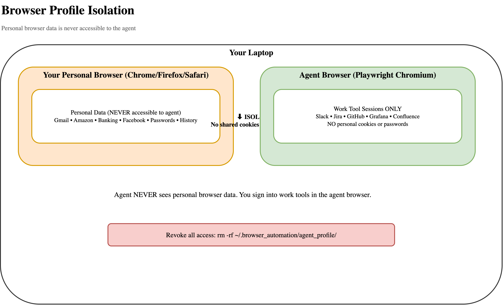

*Editable source: [browser-profile-isolation.drawio](assets/diagrams/browser-profile-isolation.drawio)*

**Key security properties**:

- ✅ **Isolated profile**: Agent uses `~/.browser_automation/agent_profile/` - completely separate from your personal browser
- ✅ **No cross-contamination**: Your personal Google account, Amazon, banking cookies are never accessible to the agent
- ✅ **Explicit sign-in required**: You manually sign into work tools in the agent's browser window
- ✅ **No API keys to steal**: Authentication happens via browser sessions, not API keys in files
- ✅ **Easy revocation**: Delete `~/.browser_automation/agent_profile/` to revoke all access instantly
- ✅ **No credential files**: No API tokens in `.env`, no OAuth secrets, no passwords in config
- ✅ **Session-only auth**: Same security model as using the tool in your browser
- ✅ **No arbitrary Playwright calls**: All browser automation goes through controlled wrappers with security checks

**Revoke all access in one command**:
```bash
rm -rf ~/.browser_automation/agent_profile/
# All sessions cleared. Agent can no longer access any tools.
# Your personal browser remains completely unaffected.
```

### Controlled Browser Automation

**All Playwright calls go through security-hardened wrappers:**

Agents never make direct Playwright calls. Instead, all browser automation is routed through Python wrapper functions that enforce security policies:

```
❌ BLOCKED: Direct Playwright calls from agents
─────────────────────────────────────────────

from playwright.sync_api import sync_playwright

with sync_playwright() as p:
    context = p.chromium.launch_persistent_context(...)
    # Agent could access any profile, navigate anywhere,
    # execute arbitrary JavaScript, exfiltrate data
    page.evaluate("window.localStorage")  # Direct access

This is NOT allowed in agent code.


✅ ALLOWED: Calls through controlled wrappers
──────────────────────────────────────────────

from shared_utils.session_request import tool_request

result = tool_request("slack", "GET",
    "https://slack.com/api/users.list")

# Wrapper enforces:
# • Profile isolation (only agent_profile)
# • Allowed tool list (from verified_connections.md)
# • URL validation (must match tool's base URL)
# • No arbitrary JavaScript execution
# • Response size limits
# • Timeout enforcement
```

**Security measures in the wrapper layer**:

1. **Profile Restriction**
   ```python
   # shared_utils/session_request.py
   ALLOWED_PROFILE = Path.home() / ".browser_automation" / "agent_profile"

   def tool_request(tool, method, url, ...):
       # Only this profile allowed - never user's personal browser
       profile_dir = ALLOWED_PROFILE

       # Agents cannot specify arbitrary profiles
       # Agents cannot access personal browser data
   ```

2. **Tool Allowlist**
   ```python
   # Only tools in verified_connections.md can be accessed
   def tool_request(tool, method, url, ...):
       if tool not in get_verified_tools():
           raise SecurityError(f"Tool {tool} not verified")

       # Prevents agent from accessing arbitrary websites
       # Prevents exfiltration to attacker-controlled domains
   ```

3. **URL Validation**
   ```python
   # URLs must match the tool's configured base URL
   def tool_request(tool, method, url, ...):
       tool_config = load_tool_config(tool)
       base_url = tool_config.get("base_url")

       if not url.startswith(base_url):
           raise SecurityError(f"URL {url} doesn't match {base_url}")

       # Prevents open redirect attacks
       # Prevents accessing unrelated services
   ```

4. **No Arbitrary JavaScript**
   ```python
   # Wrapper uses context.request API, not page.evaluate()
   def tool_request(tool, method, url, ...):
       # Makes HTTP call without executing JavaScript
       response = context.request.fetch(url, method=method, ...)

       # No page.evaluate("...") allowed
       # No access to browser DOM
       # No execution of arbitrary code in browser context
   ```

5. **Response Limits**
   ```python
   # Prevent memory exhaustion attacks
   MAX_RESPONSE_SIZE = 10 * 1024 * 1024  # 10MB

   def tool_request(tool, method, url, ...):
       response = context.request.fetch(url, ...)

       if len(response.body()) > MAX_RESPONSE_SIZE:
           raise SecurityError("Response too large")
   ```

6. **Timeout Enforcement**
   ```python
   # Prevent hung connections
   DEFAULT_TIMEOUT = 30_000  # 30 seconds

   def tool_request(tool, method, url, timeout_ms=None, ...):
       timeout = timeout_ms or DEFAULT_TIMEOUT

       response = context.request.fetch(url, timeout=timeout)
       # No infinite waits
       # Resources freed promptly
   ```

**Why this matters**:

Without wrapper control, a malicious or buggy agent could:
- ❌ Access your personal browser profile and steal cookies
- ❌ Navigate to arbitrary websites and exfiltrate data
- ❌ Execute JavaScript to scrape sensitive information
- ❌ Make unlimited requests and exhaust resources
- ❌ Connect to attacker-controlled servers

With wrapper control:
- ✅ Only the isolated agent profile is accessible
- ✅ Only verified work tools can be accessed
- ✅ URLs are validated against tool configs
- ✅ No arbitrary JavaScript execution
- ✅ Response sizes and timeouts are enforced
- ✅ All calls logged for audit

**The wrapper layer is your security boundary** - it ensures that even if an agent is compromised or behaves unexpectedly, it cannot:
- Access data outside its designated profile
- Contact arbitrary websites
- Execute malicious code in the browser
- Exhaust system resources
- Exfiltrate credentials or sensitive data

### Agent Audit Trail

Every agent action is logged and auditable:

**1. Agent Lifecycle Hooks** (`.agents/hooks/audit_subagent_lifecycle.py`)
```
What gets logged:
├── Agent spawn: timestamp, agent type, task description
├── Agent execution: tools used, APIs called
├── Agent completion: output summary, duration
└── Written to: subagent-audit.jsonl

Example audit entry:
{
  "event": "SubagentStart",
  "timestamp": "2025-03-24T14:30:00Z",
  "subagent_type": "metrics-analyst",
  "task": "Gather Grafana metrics for api-gateway"
}
```

**2. Tool Call Validation** (`.agents/hooks/block_unsafe_shell.py`)
```
Before every Bash command:
✓ Check against denied patterns
✗ Blocked: git push, terraform apply, helm upgrade
✓ Allowed: curl, grep, read-only commands

If blocked → Command rejected before execution
If allowed → Logged and executed
```

**3. Output Validation** (`.agents/hooks/validate_final_report.py`)
```
After agent completion:
✓ Validate required fields present
✓ Check for sensitive data leakage
✓ Verify output format
✗ Reject if validation fails

Report only saved if all checks pass
```

**Audit trail location**:
```bash
# All agent activity
./subagent-audit.jsonl

# Per-investigation scratchpad
./runs/{investigation_id}/scratchpad/
  ├── metrics.md          # metrics-analyst findings
  ├── logs.md             # log-analyst findings
  └── coordinator-brief.md # coordinator summary

# Final validated reports
./reports/{investigation_id}-report.md
```

**What you can audit**:
- Which agents ran and when
- What tasks each agent was given
- What tools each agent used
- What APIs were called (from browser network logs)
- What output each agent produced
- Whether validation passed or failed
- Complete timeline of every action

### Identity = Accountability

- **Your personal token**: Agent acts as you (your SSO identity, your session)
- **Your name on every action**: Every API call, ticket update, message post shows your name
- **Stronger audit trail** than most enterprise automation (where shared service accounts take actions)
- **Per-agent audit logs**: `.jsonl` logs track every agent invocation

The agent acts **as you**: you get the credit, you get the blame, and the audit log is already in every system you use.

### Write-Safety by Design

All write actions require explicit approval:

```markdown
## Agent behavior

**Read actions — run freely, no approval needed:**
- GET /api/search
- GET /api/user/me

**Write/interact actions — show preview + target URL, get explicit approval:**
- POST /api/messages (show message content + channel)
- PUT /api/tickets/{id} (show diff + ticket URL)
```

**Additional safety gates**:

1. **Pre-execution hooks**: Block dangerous commands before they run
2. **Output validation**: Verify results before saving/sharing
3. **User confirmation**: All writes show preview and require approval
4. **Audit logging**: Every action logged to `subagent-audit.jsonl`
5. **Session isolation**: Agent browser profile is separate from personal browser
6. **Controlled browser automation**: All Playwright calls through security-hardened wrappers
7. **Easy revocation**: One command to delete all agent access

## The Implementation: How It Works

### System Overview

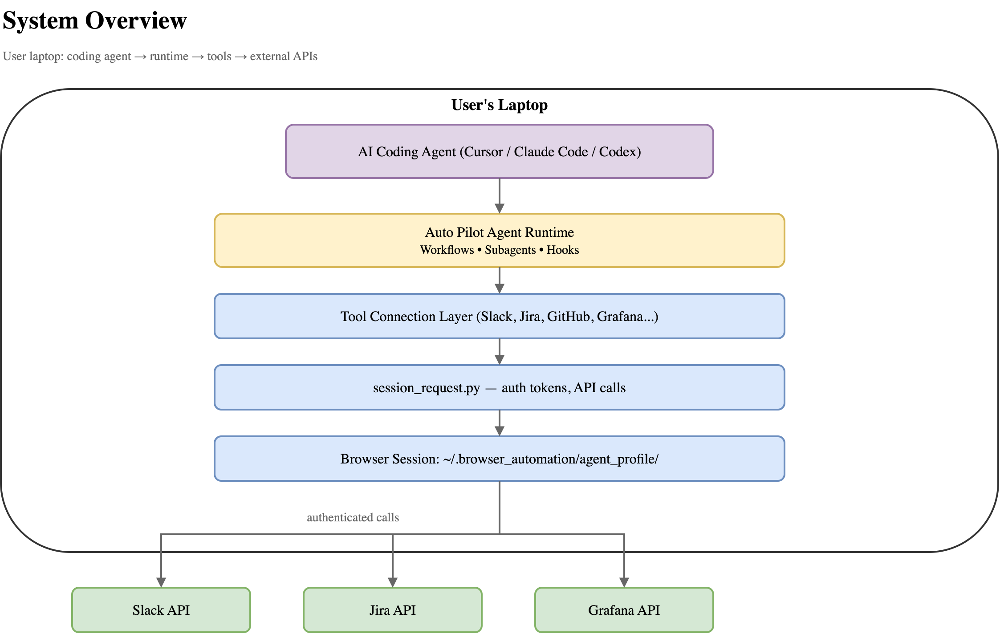

*Editable source: [system-overview.drawio](assets/diagrams/system-overview.drawio)*

### 1. Persistent Browser Profiles

Authentication is handled through Playwright persistent browser contexts:

```python
# shared_utils/browser.py
from playwright.sync_api import sync_playwright

AGENT_PROFILE_DIR = Path.home() / ".browser_automation" / "agent_profile"

def profile_dir_for(tool: str | None = None) -> Path:
    """Return the shared persistent Chromium profile used by all tools."""
    return AGENT_PROFILE_DIR

# Example: Opening a persistent browser session
def open_persistent_browser(profile_dir: Path):
    """Launch Chromium with persistent profile for authenticated sessions."""
    with sync_playwright() as p:
        # launch_persistent_context = browser + context in one
        # All cookies/storage saved to profile_dir
        context = p.chromium.launch_persistent_context(
            str(profile_dir),
            channel="chrome",      # Use system Chrome (better compatibility)
            headless=False,        # Show browser for user to sign in
            ignore_https_errors=True
        )
        page = context.new_page()
        return context, page
```

**The Flow**:

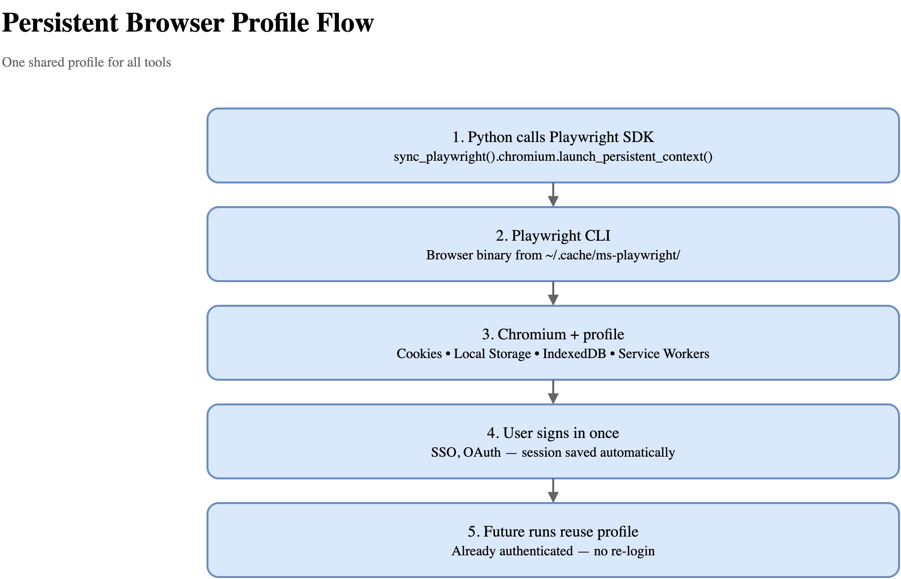

*Editable source: [persistent-browser-flow.drawio](assets/diagrams/persistent-browser-flow.drawio)*

All tools share one profile. Sign in once per tool, sessions persist for days/weeks.

**Why this works**:
- Playwright's persistent context saves all browser state to disk
- The browser profile is indistinguishable from a regular Chrome profile
- SSO providers recognize the profile as a "trusted device"
- Session cookies remain valid across script executions

**Playwright as the Foundation**:

The entire browser session infrastructure is built on Playwright because it provides:

1. **Persistent Contexts** - The killer feature
   ```python
   # Regular browser: session lost on close
   browser = p.chromium.launch()
   context = browser.new_context()  # Clean slate every time

   # Persistent context: session survives
   context = p.chromium.launch_persistent_context(
       "./profile"  # All state saved here
   )
   # Next run: already logged in!
   ```

2. **Network Interception** - For traffic sniffing
   ```python
   context.on("request", lambda req:
       print(req.url, req.headers)  # See all API calls
   )
   context.on("response", lambda res:
       print(res.status, res.body())  # Capture responses
   )
   ```

3. **Request API** - Make authenticated API calls without a page
   ```python
   # No need to navigate, just use the session:
   response = context.request.get("https://api.tool.com/data")
   print(response.json())
   ```

4. **Multiple Browser Support** - Chromium, Firefox, WebKit
   ```python
   p.chromium.launch()  # Most compatible
   p.firefox.launch()   # Privacy-focused tools
   p.webkit.launch()    # Safari-like behavior
   ```

5. **Auto-waiting** - Smart waits for network/JS
   ```python
   page.goto(url)  # Waits for page load
   page.click(btn) # Waits for element
   # No more manual time.sleep()!
   ```

**Our Python Wrappers Add**:
- **Tool abstraction**: `tool_request("slack", ...)` instead of Playwright boilerplate
- **Configuration**: Read auth method from `connection-*.md` frontmatter
- **Auth extraction**: Tool-specific logic for Slack xoxc, Confluence CSRF, etc.
- **Error handling**: Retry on session expiry, fallback to headless/headed
- **Shared profile**: All tools use one profile at `~/.browser_automation/agent_profile/`

### 2. Session-Backed API Calls

**Authentication Flow Diagram**

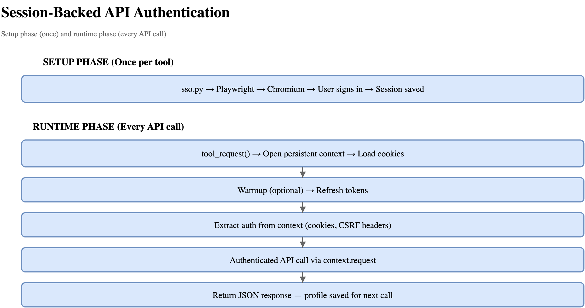

*Editable source: [session-auth-flow.drawio](assets/diagrams/session-auth-flow.drawio)*

### 3. Tool Connection as Executable Docs

Each tool has a `connection-{auth-method}.md` file with frontmatter:

```markdown
---
name: slack
auth: sso-session
env_vars:
  - SLACK_WORKSPACE_URL
sniffer:
  profile: ~/.browser_automation/agent_profile
  url: https://app.slack.com/
  filter: /api
---

# Slack — browser session

Verified: 2026-03

## Auth
Uses browser session via persistent profile.
All API calls go through session_request.py.

## Verified snippets
[Python examples with real output...]
```

The agent reads this file and knows:
- How to authenticate
- What environment variables are needed
- What the verified API calls look like
- What the expected output format is

### 4. Agent Orchestration

**Agent Lifecycle & Context Isolation**

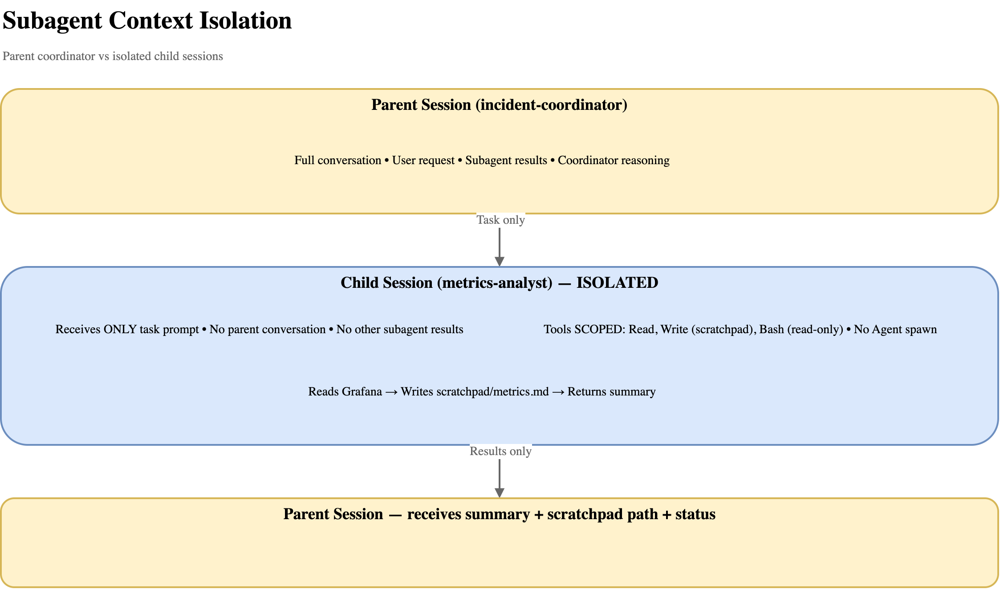

*Editable source: [subagent-context-isolation.drawio](assets/diagrams/subagent-context-isolation.drawio)*

Each specialized agent:
- Runs in **isolated context** (doesn't see parent conversation)
- Has **scoped tools** (defined in its markdown frontmatter)
- Writes to **its own scratchpad** (`runs/{investigation_id}/scratchpad/`)
- Returns **structured findings**

The coordinator aggregates findings and passes to the reporter.

### 5. Multi-Agent Communication via Scratchpad & Brief

**Structured context management for complex multi-agent workflows:**

One of the key innovations in the Auto Pilot Agent architecture is a **generic pattern for multi-agent communication** that solves the context management problem: how do multiple specialized agents collaborate on a complex task without sharing conversational context?

**The Challenge**:
- Each agent runs in **isolated context** (no shared conversation history)
- Agents need to build on each other's work without re-doing tasks
- Coordinators must maintain coherent state across multiple delegations
- All findings must preserve **provenance** (citations to sources)

**The Solution: Scratchpad + Brief Pattern**

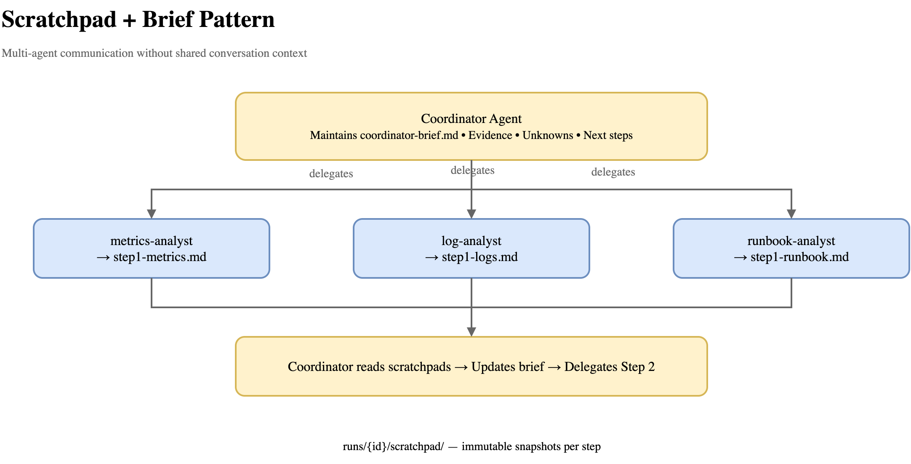

*Editable source: [scratchpad-brief-pattern.drawio](assets/diagrams/scratchpad-brief-pattern.drawio)*

**Workspace Layout**:
```
runs/<investigation_id>/scratchpad/
├── coordinator-brief.md           # Live state (overwritten each step)
├── step1-metrics-analyst.md       # Immutable snapshot
├── step1-log-analyst.md           # Immutable snapshot
├── step1-runbook-analyst.md       # Immutable snapshot
├── step2-service-source-analyst.md
└── step3-incident-reporter.md
```

**The Structured Finding Brief** (`coordinator-brief.md`):

Every coordinator maintains a living document with:

| Field | Purpose |
|-------|---------|
| **Task scope** | Top-level inputs (service, env, symptom, time window) |
| **Current working status** | One-line summary of where the investigation stands |
| **Confirmed evidence** | Findings with concrete citations (dashboard URLs, log queries, etc.) |
| **Ruled out** | Hypotheses excluded by evidence |
| **Unknowns/gaps** | Things not yet confirmed, missing config, unreachable systems |
| **Unrelated/background signals** | Observations not yet tied to the task |
| **Next step plan** | Which specialists to run next and why |

**Specialist Scratchpad Format** (`step1-metrics-analyst.md`):

Every specialist writes:
```markdown
# Metrics Analyst — Step 1

## Key findings
- p95 latency increased to 2.3s (was 400ms baseline)
  Source: Grafana dashboard "API Gateway Performance"
  Panel: "Request Latency p95"
  Time: 2024-03-24 14:23-14:45 UTC
  URL: https://grafana.company.com/d/api-gw?from=...

- Memory utilization at 95% (limit: 2GB)
  Source: Grafana dashboard "Container Resources"
  ...

## Unknowns/gaps
- Restart count panel returned 403 Forbidden
  (requires Admin role - current user lacks permission)

## Handoff summary
High latency (2.3s p95) correlates with memory pressure (95%
utilization). Unable to confirm restart pattern due to permission
issue on restart metrics.
```

**How Task Prompts Work**:

Every specialist receives a task prompt with:
1. **The current Structured Finding Brief** (verbatim)
2. **Paths to prior scratchpads** (if building on earlier work)
3. **Specific question** for this delegation
4. **Exact output scratchpad path** to write

Example:
```
Task Prompt for log-analyst (Step 1):

[Structured Finding Brief]
Task scope: service=api-gateway, env=production, symptom=high-latency,
window=last-2h
Current working status: Step 1 - gathering initial evidence
Confirmed evidence: none yet
Ruled out: none yet
Unknowns/gaps: none yet

[Specific Question]
Search production logs for api-gateway errors and warnings in the
last 2 hours. Focus on connection timeouts, OOM errors, and
readiness probe failures.

[Output]
Write findings to: runs/api-gateway-20240324T142300Z/scratchpad/step1-log-analyst.md

[Prior Scratchpads]
None (this is step 1)
```

**Benefits of This Pattern**:

1. **Isolated Context** ✅
   - Each agent only knows what's in its task prompt
   - No conversational context leaks between agents
   - Clean separation of concerns

2. **Explicit Context Passing** ✅
   - Brief explicitly states what's known
   - No assumptions about shared state
   - Everything is written down

3. **Provenance Preservation** ✅
   - Every finding cites its source
   - Citations flow from specialist → brief → next specialist
   - Audit trail is built-in

4. **Incremental Building** ✅
   - Each step builds on prior evidence
   - No redundant work (specialists read prior scratchpads)
   - Coordinator maintains coherent state

5. **Parallel Execution** ✅
   - Multiple specialists run in same step (when independent)
   - Each writes to its own scratchpad (no conflicts)
   - Coordinator waits for all, then aggregates

6. **Immutability** ✅
   - Each scratchpad is a snapshot (never edited)
   - New delegation = new file (stepN-specialist.md)
   - Clear progression through investigation

**Generic Rules in the Project**:

The project includes two reusable rules that any coordinator/specialist can follow:

1. **`.agents/rules/coordinator-scratchpad.md`**
   - How coordinators manage the Structured Finding Brief
   - Step lifecycle (parallel vs. sequential delegations)
   - Task prompt template
   - Scratchpad path conventions

2. **`.agents/rules/subagent-scratchpad.md`**
   - Required sections for specialist scratchpads
   - Content limits (summaries only, no raw logs)
   - When to read vs. write
   - Return value format

**Real Example: Incident Investigation**

```
Step 1 (parallel):
  Coordinator delegates to:
    • metrics-analyst → step1-metrics.md
    • log-analyst → step1-logs.md
    • runbook-analyst → step1-runbook.md

  All receive same brief, different questions

  Coordinator reads all three scratchpads
  Updates coordinator-brief.md with:
    • Confirmed: High latency + memory pressure (metrics)
    • Confirmed: OOM errors in logs (logs)
    • Confirmed: Similar incident last month (runbook)
    • Unknown: Restart count (permission error)

Step 2 (sequential):
  Coordinator delegates to:
    • service-source-analyst → step2-source.md
      (looks at code based on OOM evidence from step 1)

  Receives updated brief + step1 scratchpads

  Coordinator updates brief again

Step 3 (final):
  Coordinator delegates to:
    • incident-reporter → step3-report.md
      (synthesizes all evidence into final report)

  Receives complete brief + all scratchpads
  Produces final report with timeline, evidence, recommendations
```

This pattern enables **complex multi-step reasoning** across multiple specialized agents while maintaining **clean context boundaries**, **provenance tracking**, and **auditability**.

### 6. Hooks for Governance

**Hook Execution Flow**

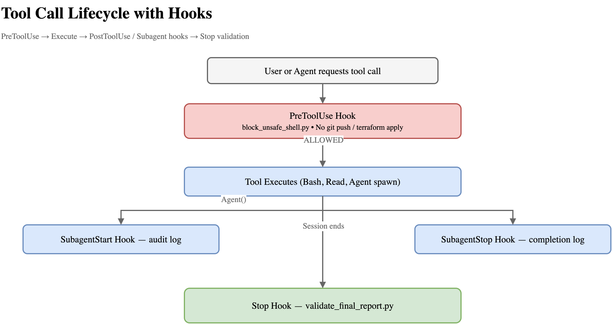

*Editable source: [hook-execution-flow.drawio](assets/diagrams/hook-execution-flow.drawio)*

Hooks enforce safety constraints:

```python
# .agents/hooks/block_unsafe_shell.py
DENIED_PATTERNS = [
    (r'\bgit\s+push\b', 'git push'),
    (r'\bhelm\s+upgrade\b', 'helm upgrade'),
    (r'\bterraform\s+(apply|destroy)\b', 'terraform apply/destroy'),
]

def _find_violation(command: str) -> str | None:
    for pattern, description in DENIED_PATTERNS:
        if re.search(pattern, command, re.IGNORECASE):
            return description
    return None
```

Hooks run at lifecycle events:
- **PreToolUse**: Before Bash commands execute
- **SubagentStart**: When a subagent spawns
- **SubagentStop**: When a subagent completes
- **Stop**: When the main session ends

## The Agent Development Experience

Creating new specialized agents is straightforward:

1. **Define the agents** (markdown files with tool permissions and instructions)
2. **Write the coordinator logic** (how to decompose and delegate tasks)
3. **Add validation hooks** (for safety and output validation)
4. **Test against live instances**

Example: Adding a deployment validation agent

```markdown
---
name: deployment-validator
tools:
  - Read
  - Bash
---

# Deployment Validator

Verify deployment readiness before production.

## Steps
1. Check all tests pass
2. Verify staging deployment succeeded
3. Check no critical incidents in last 24h (via Grafana/PagerDuty)
4. Verify changelog updated
5. Check dependencies up to date

## Evidence
Document each check with:
- Command run
- Output received
- Pass/fail verdict
```

The agent reads this and executes the workflow.

## What This Enables

### For Individual Contributors

- **10x productivity** through automation of repetitive cross-tool work
- **Institutional memory** that survives team changes
- **Context switching eliminated** (one question, all tools)

### For Teams

- **Shared workflows** as version-controlled markdown
- **Consistent processes** across team members
- **Knowledge capture** through documented workflows

### For Organizations

- **Bottom-up transformation** (no platform rollout needed)
- **Individual empowerment** spreads organically
- **Audit trails** through personal identity
- **No vendor lock-in** (markdown + local tools)

## Real-World Examples

### 1. Enterprise Search

**Before**: Open Slack, search "API deprecation decision", scroll, switch to Confluence, search again, check Jira, check GitHub PRs, mentally stitch together 5 partial answers.

**After**:
```
Search for everything related to the decision to deprecate the v1 API.
```

Agent fans out across all connected tools, synthesizes answer with citations.

### 2. Incident Investigation

**Before**: Jump between Grafana dashboards, Kibana logs, Confluence runbooks, Slack threads. Copy-paste findings into a Google Doc. Take 30-60 minutes.

**After**:
```
/investigate-incident service=api-gateway env=prod symptom=high-latency window=last-2h
```

Coordinator delegates to specialists in parallel, produces structured report in 2-3 minutes.

### 3. PR Context Gathering

**Before**: Read PR description, check linked ticket, search Slack for discussions, check related PRs, piece together context.

**After**:
```
Give me the full context on PR #1234
```

Agent pulls:
- PR description, commits, comments
- Linked Jira ticket and its history
- Slack threads mentioning the PR
- Related PRs and tickets
- Meeting notes from calendar events

All in one response.

## Conclusion

AI coding assistants have evolved beyond code—they're now capable of orchestrating complex workflows across all your work tools.

The Auto Pilot Agent project demonstrates that you don't need:
- ❌ Platform rollouts
- ❌ IT approvals
- ❌ New infrastructure
- ❌ Vendor middleware
- ❌ OAuth app registrations

You just need:
- ✅ A coding agent you already use
- ✅ The tools you already have access to
- ✅ A local-first integration layer
- ✅ Workflows as executable documentation

The result is a **personal AI assistant for work** that:
- Acts as you (your identity, your permissions)
- Works across all your tools (connected through browser sessions via Playwright)
- Executes sophisticated tasks (through specialized agents sharing the same infrastructure)
- Coordinates complex multi-step workflows (via structured scratchpad & brief pattern)
- Requires no IT involvement (local-first, zero infrastructure)

If every individual becomes 10x more productive, teams and companies become 10x more productive—not through top-down transformation, but through bottom-up empowerment.

The automation you need is already possible. You just need to connect it.

---

**Project**: [github.com/apssouza22/auto-pilot-agent](https://github.com/apssouza22/auto-pilot-agent)


